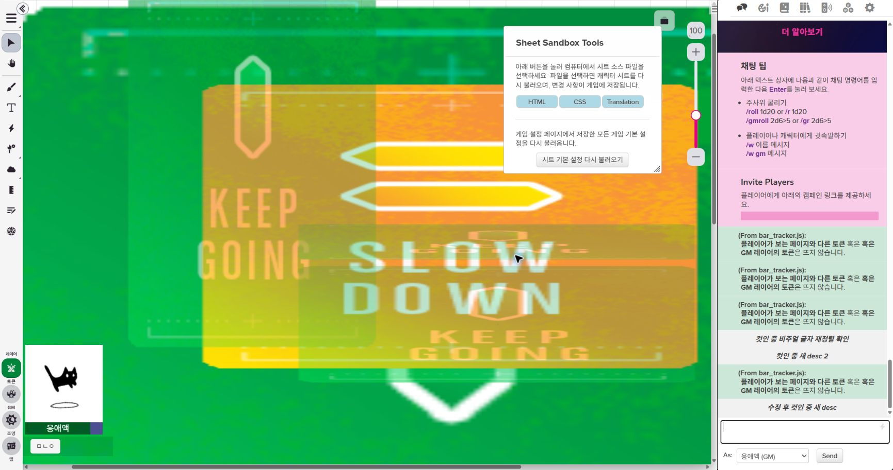
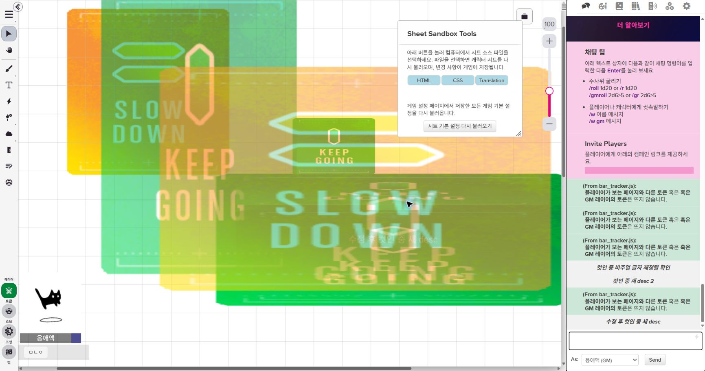
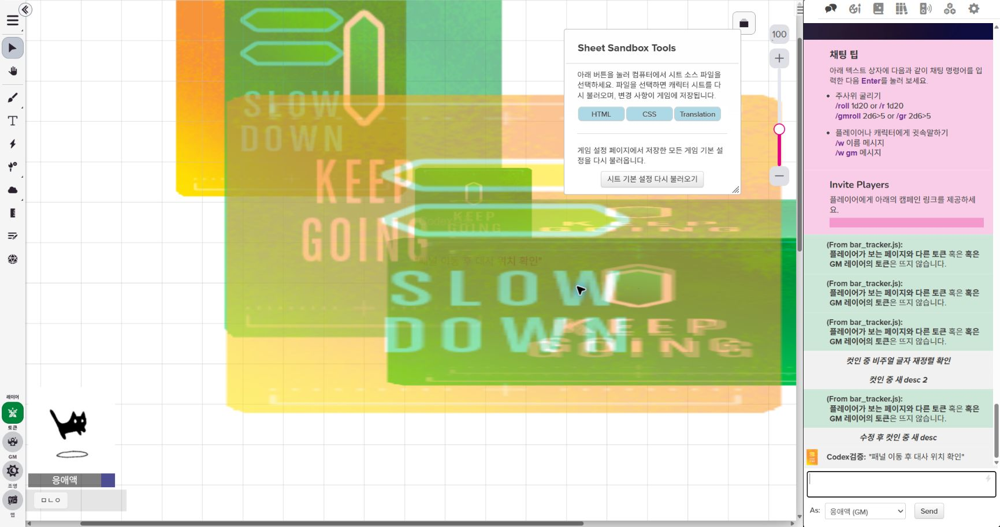

# 배포 전 최적화 검증 보고서

작성일: 2026-08-30

비교 기준: `9eb10a50f348bd8b09e15ebed3a97cc627e2826e`

작업 브랜치: `codex/pre-release-optimization`

## 결론

현재 변경은 기존 표시 순서와 연출 순서를 보존하는 범위에서 적용했다. 자동 회귀검사, 문법 검사, 출력 동등성 검사, 성능 측정과 Roll20 개발방의 실제 화면 검증을 통과했다. 01·03·05·07·08·09번의 기존 실검증에 더해 최종 10번 서버 저장본도 줄바꿈을 통일해 계산한 SHA-256이 로컬 파일과 같았다.

실제 검증 중 세 가지를 추가로 발견하고 고쳤다. Roll20에서 콜백으로만 읽을 수 있는 핸드아웃 `notes`를 03·09가 동기식으로 읽던 오류는 해당 필드만 기존처럼 바로 쓰게 바꿨다. 정식 카드 토큰이 컷인 종료 후 패널 아래로 내려가는 현상은 다음 틱에 기존 카드 정렬 함수를 한 번 재사용해 복구했다. 또 시작 이성이 비어 있을 때 최대 이성으로 비율을 계산하던 표시를 없애고 `현재 / 시작 미입력 / 최대`로 분리했다. 실제 시트의 근력 버튼을 눌러 판정 컷인이 나타났다가 설정 시간 뒤 사라지는 것까지 확인했다.

## 2026-08-31 추가 최적화

- `!!굴릴항목이름` 검색은 이미 만들어 둔 캐릭터별 굴림 목록을 재사용한다. 이전에는 명령 한 번마다 Attribute 전체 조회와 굴림 목록 조립을 다시 했고, 일부 일치·미일치 명령은 정확 일치 확인과 일반 검색에서 이를 두 번 반복했다.
- 굴림 실행 직전 빈 값 검증도 같은 Attribute 객체 목록을 재사용한다. 관련 수치·반복행이 추가·변경·삭제되면 기존 이벤트가 두 캐시를 함께 비우므로, 사용자 추가 기능·무기·주문과 현재 값은 다음 명령에서 다시 읽힌다. 무관한 메모 변경은 재분석하지 않는다.
- 같은 Node/V8 모의 실행기에서 `!!민첩` 200회 중앙값은 `206.557 ms → 114.303 ms`로 44.7% 감소했다. 7회 측정 동안 캐릭터 Attribute 전체 조회는 `2,800회 → 0회`였다. 실제 Roll20 네트워크·렌더링 시간은 포함하지 않은 방향성 측정이다.
- 캐시 적중 시 굴림 목록 획득은 `O(1)`이 됐다. 이름 후보 비교는 기존 결과와 모호성 처리 순서를 보존하기 위해 `O(R×M×Q)`로 유지했다. 여기서 `R`은 현재 캐릭터의 굴림 수, `M`은 굴림별 이름·선택지 수, `Q`는 짧은 검색어 길이다. 별도 인덱스를 더 넣는 것은 현재 측정상 복잡도와 무효화 위험에 비해 이득이 작아 적용하지 않았다.
- 생성 코드 구역 표식은 `KIB_SHEET_RECOGNITION_*`에서 `SCENE_SUITE_SHEET_RECOGNITION_*`로 바꿨다. 이 표식은 빌드 도구가 구역을 찾는 주석일 뿐 실행 상태가 아니다. 기존 방 설정과 00~10번 연결에 쓰이는 `KIBScene`, `state.KIB*` 이름은 호환성을 위해 유지했다.
- 개발방의 10번을 0.6.13으로 교체한 뒤 샌드박스는 5.48초에 정상 기동했다. 현재 `As`를 `Awaesk Uho`로 바꾸고 `!!민첩`을 실행해 원본 시트 디자인으로 민첩성 50 판정과 성공 결과가 출력되는 것을 확인한 뒤, `As`는 GM 오너 프로필로 복구했다.

## 작업 전 백업

- 작업 시작점과 원격 브랜치가 모두 `9eb10a50f348bd8b09e15ebed3a97cc627e2826e`인지 확인한 뒤 수정했다.
- 기존 `codex/sheet-helper-integration` 브랜치는 수정하지 않았다.
- 최적화는 별도 `codex/pre-release-optimization` 브랜치에서만 진행했다.

## 바꾸지 않은 동작

| 항목 | 확인 결과 |
|---|---|
| `toFront`, `toBack`, 레이어 변경 | 기존 정렬 순서는 수정하지 않음. 컷인 그래픽 삭제가 끝난 뒤 정식 카드 토큰을 복구하는 다음 틱 예약만 추가 |
| 컷인 표시·종료 시간 | 시간 계산과 종료 예약 로직을 수정하지 않음 |
| 스탠딩·맵시트·패널 생성 순서 | 생성과 정렬 흐름을 수정하지 않음 |
| 대사창 글자 출력 순서 | 모든 중간 프레임이 기존 결과와 같음을 검사 |
| `!.` 동시 출력, `@다음줄 1.2초` | 00번 회귀검사 통과 |
| 오디오 재생·중지·페이드 | 실행 로직은 수정하지 않고 동일한 매크로 재저장만 생략 |
| 기존 `state`, 사용자 설정, 별칭, 이전 버전 이전 처리 | 삭제하거나 이름을 바꾸지 않음 |
| 매크로·핸드아웃 형식과 정렬 | 결과 HTML과 명령 문자열 동등성 검사 통과 |
| 시트 인식 데이터와 사용자 추가 반복 항목 | 인식 결과 SHA-256과 반복행 순서·내용 동등성 검사 통과 |

## 적용한 최적화

| 파일 | 변경 | 기존 비용 | 변경 후 비용 | 동작 보존 근거 |
|---|---|---|---|---|
| 02 오디오 | 값이 같은 매크로의 `set` 생략 | 매 갱신마다 쓰기 1회 | 변경 시에만 쓰기 | 재생·중지·페이드 코드 미수정 |
| 03 비주얼 노벨 | 캐릭터마다 덱과 카드 전체를 다시 찾지 않고 한 번 읽은 목록 재사용. 컷인 그래픽 삭제 뒤 기존 카드 정렬 함수를 다음 틱에 한 번 재사용 | Roll20 객체 검색량이 캐릭터 수에 따라 제곱으로 증가. 컷인 종료 후 정식 카드가 패널 아래로 내려갈 수 있음 | Roll20 객체 검색은 한 번의 목록 조회로 감소. 컷인 종료 후 정식 카드 최상단 복구 | 카드 이름 중첩 매칭과 카드끼리의 기존 순서는 그대로 유지 |
| 04 이미지 전환 | 관계없는 덱의 카드 변경은 갱신하지 않음 | 모든 카드 이벤트에서 전체 갱신 | 관련 덱의 현재값 또는 이전값이 걸릴 때만 갱신 | 덱 이동·이름 변경의 이전값도 확인 |
| 05 대사창 | 매 글자마다 처음부터 줄바꿈을 다시 계산하지 않고 누적 | 줄바꿈 재계산 `O(L²)` | 줄바꿈 재계산 `O(L)` | 모든 글자 프레임의 깊은 비교와 SHA-256 일치. 글자별 `get`·`set`·`toFront`는 그대로 |
| 06 APNG | 관계없는 카드·덱 이벤트 제외, 같은 매크로 값 쓰기 생략 | 모든 카드·덱 이벤트에서 갱신 | 관련 덱 이벤트만 갱신 | 중복 매크로 삭제는 그대로 실행 |
| 07 핸드아웃 | 권한 이름 계산에서 캐릭터 목록 재사용 | 핸드아웃마다 캐릭터 전체 재조회 | 한 번 조회한 목록 재사용 | HTML과 정렬 결과 SHA-256 일치 |
| 08 컷인 | 캡션 누적, 덱·카드 목록 공유, 관계없는 이벤트 제외 | 캡션 조립 `O(L²)`, 결합 갱신 시 덱·카드 중복 조회 | 캡션 조립 `O(L)`, 결합 갱신에서 목록 1회 | 유니코드 포함 모든 캡션 프레임 일치, 컷인 시간 미수정 |
| 09 캐릭터 이미지 | 덱·카드·캐릭터 목록 재사용, 동기 비교 가능한 같은 값 쓰기 생략 | Roll20 객체 검색량이 캐릭터 수에 따라 제곱으로 증가 | Roll20 객체 검색은 한 번의 목록 조회로 감소 | 이름 겹침을 포함한 기존 매칭 순서는 유지. `notes`는 Roll20의 콜백 전용 필드라 `set` 호출은 유지하고 전송 필드만 줄임 |
| 10 시트 헬퍼 | 반복행 포함 여부 표 사용, 캐릭터 목록 재사용, 반복 선택 방식을 51개 문자열로 한 번만 직렬화. 실제 HTML/CSS/번역에서 읽은 5종 시트 정보를 공통 구조로 압축 | 반복행 정렬 `O(R²)`, 캐릭터 검색 최대 2회, 같은 선택 방식 527회 반복 직렬화 | 반복행 정렬 `O(R log R)`, 캐릭터 검색 1회, 굴림별 독립 배열 복원 | 반복행·선택지·현재/시작/최대 수치·직접 시트 굴림 식별 정보를 압축 전후 깊은 비교. 특정 시트 변수명으로 직접 조회·변경하는 경로 없음 |

03번과 09번은 카드 이름이 다른 캐릭터 이름을 포함하는 기존 규칙을 보존해야 하므로 캐릭터와 카드의 이름 비교 자체는 `O(C×K)`로 남겼다. 이번에 줄인 것은 Roll20 저장소를 반복해서 전부 훑는 횟수다. 이름 매칭 방식을 더 줄이면 표시 대상과 순서가 달라질 수 있어 이번 범위에서는 건드리지 않았다.

## 측정 결과

측정값은 같은 PC에서 기준 커밋과 현재 작업 파일을 동일한 Roll20 모의 실행기에 넣은 중앙값이다. 실제 Roll20 서버 지연이 아니라 코드 자체와 Roll20 객체 API 호출량을 비교한 값이다.

| 대상 | 입력 크기 | 기준 | 최적화 후 | 변화 |
|---|---:|---:|---:|---:|
| 05 대사 줄바꿈 문자열 계산 | 10,000자 | 656.093 ms | 0.123 ms | 약 99.98% 감소 |
| 08 컷인 캡션 문자열 계산 | 10,000자 | 1,124.263 ms | 0.108 ms | 약 99.99% 감소 |
| 03 관리 갱신 | 1,000개 규모 | 4,278.294 ms | 1,040.435 ms | 75.7% 감소 |
| 09 관리 갱신 | 1,000개 규모 | 5,481.793 ms | 1,981.472 ms | 63.9% 감소 |
| 10 반복행 정렬 | 10,000행 | 122.662 ms | 28.786 ms | 76.5% 감소 |
| 10 인식 데이터 로딩 중앙값 | 실제 5개 시트, 21회 | 9.074 ms | 7.890 ms | 13.1% 감소 |
| 10 인식 데이터 로딩 p95 | 실제 5개 시트, 21회 | 17.081 ms | 22.805 ms | 33.5% 증가 |

호출량 비교:

- 03, 1,000개 규모: `findObjs` 5,001회 → 3회, 검사 객체 25,010,001개 → 15,003개다. `notes`가 Roll20의 콜백 전용 필드라 `set` 호출은 1,000회 → 1,000회로 유지되지만, 전송 필드는 6,000개 → 1,000개로 줄었다.
- 09, 1,000개 규모: `findObjs` 6,002회 → 3회, 검사 객체 30,022,004개 → 15,006개다. 같은 이유로 `set` 호출은 1,001회 → 1,001회로 유지되지만, 전송 필드는 6,005개 → 1,001개로 줄었다.
- 07: 캐릭터가 1,000명인 조건에서 캐릭터 조회 1,001회 → 1회, 동일값 `set` 1회 → 0회, 관계없는 매크로 이벤트 갱신 1회 → 0회.
- 10: 반복되는 선택 방식 직렬화는 527회 → 51회다. 복원된 배열과 객체는 기준판과 똑같이 1,375개 굴림별로 독립적이고 수정 가능해, 한 굴림의 변경이 다른 굴림에 번지지 않는다.

05와 08의 큰 감소율은 **문자열을 만드는 계산만** 잰 값이다. 실제 Roll20에서는 글자마다 실행되는 객체 `get`·`set`·`toFront`와 클라이언트 렌더 비용이 남아 있으므로, 이 수치를 전체 대사창 재생시간 감소율로 해석하지 않는다. 해당 API 호출 순서는 표시 순서 보존을 위해 바꾸지 않았다.

작은 입력에서는 새 조건 검사 비용이 상대적으로 크게 보일 수 있다. 09는 10개에서 1.455 ms → 2.256 ms(55.1% 증가), 10 반복행은 100개에서 0.273 ms → 0.295 ms(7.9% 증가)로 측정됐다. 둘 다 절대값은 약 2.3 ms 이하이며 입력이 늘면 개선된다. 03은 10개부터 1.657 ms → 1.555 ms로 개선됐다. 인식 데이터 로딩 p95도 이번 실행에서는 증가했으므로 실제 Roll20 반응 속도가 개선됐다고 단정하지 않는다. 작은 입력과 편차가 큰 수치를 숨기지 않고 배포 판단에 포함했다.

## 정리한 개발 흔적

- README와 검증 문서에 남아 있던 사용자 PC 절대경로를 일반적인 예시 경로로 교체했다.
- 브라우저 배포에 필요 없는 시트 분석 도구를 `public/assets`에서 `tools`로 옮겼다. 빌드와 검사는 같은 파일을 계속 사용한다.
- 테스트용 `__benchmark`, `__optimizationTest`는 검사 도구가 메모리에서만 임시로 덧붙이며 `public/scripts`에는 들어가지 않는다.
- 원문 제공 페이지의 `sources.js`는 최종 코드에서 다시 생성했다.

## 배포 파일 크기

| 범위 | 기준 | 최적화 후 | 변화 |
|---|---:|---:|---:|
| 00~10 스크립트 | 1,955,048 bytes | 1,962,189 bytes | 7,141 bytes 증가, 0.4% |
| gzip 기준 00~10 스크립트 | 227,547 bytes | 269,580 bytes | 42,033 bytes 증가, 18.5% |
| 배포되는 전체 텍스트 | 4,220,924 bytes | 4,136,990 bytes | 83,934 bytes 감소, 2.0% |
| gzip 기준 전체 텍스트 | 482,001 bytes | 545,308 bytes | 63,307 bytes 증가, 13.1% |

시트 분석 도구 73,836 bytes는 `public`에서 `tools`로 옮겼다. 10번은 LF 기준 1,528,932 bytes로 현재 검사 한도 1,750,000 bytes보다 221,068 bytes 작다. 다음 대형 시트를 추가하기 전에는 임베드 데이터 추가 압축이 필요하다.

00~10을 난독화·최소화하는 압축은 적용하지 않았다. Roll20 편집기에 직접 붙여 넣는 배포 방식, 오류 줄 추적, 기존 주석 가독성을 보존했다.

## 자동 검증

- `node tools/check.js`: 통과
- `node tools/benchmark.js --ref 2a65494 --recognition-only`: 인식 데이터 5종, 굴림 1,375개와 실행 결과 동등성 통과
- `node tools/benchmark.js --ref 13a57d4 --rows-only`: 반복행 순서와 내용 동등성 통과
- `public/scripts`와 `tools`의 JavaScript 22개 문법 검사: 통과
- `git diff --check`: 오류 없음. Windows 줄바꿈 안내만 출력
- 공개 파일의 사용자 PC 절대경로 검사: 발견 없음
- 00번 확장 명령, 대사 지연, 오디오 초기화 제거, 독립 사용 조건: 회귀검사 통과
- 08·09의 실제 등록 이벤트 콜백으로 무관 카드 무시, 대상 덱 진입·이탈, 덱 이름 변경 전후 검사 통과

더 오래된 `9eb10a5`는 복구된 시트 굴림 동작보다 앞선 커밋이므로 10번 실행 결과 동등성의 기준으로 사용하지 않는다. 해당 커밋은 전체 배포 크기와 이미 분리된 05·08 문자열 계산 비교에만 사용했다.
- 03의 그래픽 삭제 이벤트가 다음 틱에 정식 카드 토큰을 복구하는 실행 검사 통과

## Roll20 개발방 확인

서버와 로컬의 비교는 Roll20이 저장하며 바꾸는 줄바꿈만 LF로 통일한 뒤 계산했다.

| 파일 | 서버와 로컬 | SHA-256 | 확인 결과 |
|---|---|---|---|
| 01 Narrator Director | 일치 | `865fb46f92cc603e2a1821fce3813f2759cd3e94ebc29a769e105d315749896b` | `/as`, `/desc`, 표정 연동 실행 |
| 03 Visual Dialogue | 일치 | `c911ce8ff5df0cca121ba55b6d0bb9d3b0b4bb4d5f0e08f05788c328a142d898` | 분리 패널, 위치 이동, 정식 카드와 컷인 순서 실행 |
| 05 Dialog Overlay | 일치 | `913a60125597c33cfbecb026eb284e7990afdd4713f84d99f3510a3908d3cf54` | 컷인 중 새 글자 생성과 재정렬 실행 |
| 07 Handout Director | 일치 | `9db45073cbb58b70837b8d43ccce2e78fa2355004e2f0578ec21df751b46eaef` | 관리 핸드아웃 생성과 버튼 확인 |
| 08 Cutin Director | 일치 | `47ef962021814ed9ec739a5eab7bdc7e553fab9c91f1a01acb4aa7e7d07b13e7` | 오버레이 저장·제거, 재생·종료, 새 객체 위 순서 확인 |
| 09 Avatar Director | 일치 | `1c77f1e4abfb643f45cbafcc9371808e4f6d1e6fe976656a7311a52ffdb0b4f4` | 같은 표정 반복과 03 연동 실행 |
| 10 Sheet Helper | 일치 | `5366679f20cdbaf08c539852fed0c6a452f26094897b940d84ef6a912038535d` | 샌드박스 정상 기동, `캐릭터별 현황 보기`에서 이름 버튼은 현황과 아래 표만 바꾸고 실제 명령은 현재 `As`만 사용한다고 표시, 기존 시트 굴림과 컷인 연결 확인 |

정식 카드 토큰은 일반 그래픽에 카드 ID를 적은 흉내가 아니라 Roll20의 `drawCard`와 `playCardToTable`로 생성했다. `_subtype`은 `card`, `_cardid`는 원본 카드 ID로 확인됐다.

객체 순서의 숫자가 클수록 화면 위다.

- 컷인 전: 패널과 글자 `22~24` < 정식 카드 `27`
- 컷인 중 새 글자 생성 후: 정식 카드 `24` < 새 글자와 패널 `25~28` < 컷인 오버레이와 카드 `29~30`
- 컷인 종료 후: 패널과 글자 `25~27` < 정식 카드 `30`

대사 패널과 스크립트 패널의 위치를 옮긴 뒤 `/as`와 `/desc`를 다시 실행해 새 위치를 기준으로 생성되는 것도 확인했다. 같은 표정을 반복 실행했을 때 스탠딩 위치와 크기가 움직이지 않았다.

검증용 스크립트 `zz_codex_visual_fixture.js`와 테스트 이름이 붙은 자산은 개발방 편집기에 남아 있어 재검증에 쓸 수 있다. 이 스크립트와 자산은 저장소와 배포물에는 포함되지 않으며, 운영 모듈 검증 결과와 구분해 기록했다. 최종 10번 저장 뒤 샌드박스는 1.90초에 정상 기동했다. 기존 캐릭터에서 출력된 `ori_other_skills_title`, `magic_*` 경고는 이번 최적화와 별개의 희소 시트 데이터 경고이며 샌드박스를 중지시키지 않았다.

## 최종 배포 전 남은 확인

실제 화면 회귀 확인까지 끝났으므로 이 브랜치는 배포 후보로 원격 백업할 수 있다. 기본 브랜치 병합과 CI/CD 실행은 사용자가 배포 시점을 정한 뒤 진행한다.
